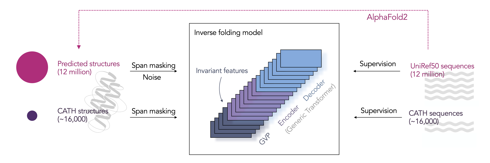

# Inverse folding with ESM-IF1

The ESM-IF1 inverse folding model is built for predicting protein sequences 
from their backbone atom coordinates. We provide scripts here 1) to sample sequence 
designs for a given structure and 2) to score sequences for a given structure. 

Trained with 12M protein structures predicted by AlphaFold2, the ESM-IF1
model consists of invariant geometric input processing layers followed by a
sequence-to-sequence transformer, and achieves 51% native sequence recovery on
structurally held-out backbones with 72% recovery for buried residues.
The model is also trained with span masking to tolerate missing backbone
coordinates and therefore can predict sequences for partially masked structures.

More details in our bioRxiv [pre-print](https://doi.org/10.1101/2022.04.10.487779).



## Recommended environment
It is highly recommended to start a new conda environment from scratch due to
potential CUDA compatability issues between pytorch and the pytorch-geometric
package required for the inverse folding model.

To set up a new conda environment with required packages,

```
conda create -n inverse python=3.9
conda activate inverse
conda install pytorch cudatoolkit=11.3 -c pytorch
conda install pyg -c pyg -c conda-forge
conda install pip
pip install biotite
pip install git+https://github.com/facebookresearch/esm.git
```

## Quickstart

### Sample sequence designs for a given structure
To sample sequences for a given structure in PDB or mmCIF format, use the
`sample_sequences.py` script. The input file can have either `.pdb` or
`.cif` as suffix.

For example, to sample 3 sequence designs for the golgi casein kinase structure
(PDB [5YH2](https://www.rcsb.org/structure/5yh2); [PDB Molecule of the Month
from January 2022](https://pdb101.rcsb.org/motm/265)), we can run the following
command from the `examples/inverse_folding` directory:
```
python sample_sequences.py data/5YH2.pdb \
    --chain C --temperature 1 --num-samples 3 \
    --outpath output/sampled_sequences.fasta
```

The sampled sequences will be saved in a fasta format to the specified output file.

**By default, the script only loads the backbone of the specified target chain 
as model input.** To instead use the entire complex backbone as model input for 
conditioning, use the `--multichain-backbone` flag to load all chains. (In the
example below, the encoder loads the backbone of all chains as input to the
encoder, and the decoder samples sequences for chain C.)
```
python sample_sequences.py data/5YH2.pdb \
    --chain C --temperature 1 --num-samples 3 \
    --outpath output/sampled_sequences_multichain.fasta \
    --multichain-backbone
```

The temperature parameter controls the sharpness of the probability
distribution for sequence sampling. Higher sampling temperatures yield more
diverse sequences but likely with lower native sequence recovery.
The default sampling temperature is 1. To optimize for native sequence
recovery, we recommend sampling with low temperature such as 1e-6.

**We recommend trying both the single-chain and multi-chain design modes.** While in
our paper we showed that conditioning on the entire multi-chain backbone often
reduces perplexity and increases sequence recovery, on some proteins the
single-chain performance is better.

Sometimes, one failure mode in sampled sequences is a high number of repeated
amino acids, e.g. `EEEEEEEE`. We recommend checking for that and filtering out
sampled sequences with long repeats.

### Scoring sequences
To score the conditional log-likelihoods for sequences conditioned on a given
structure, use the `score_log_likelihoods.py` script.

For example, to score the sequences in `data/5YH2_mutated_seqs.fasta`
according to the structure in `data/5YH2.pdb`, we can run
the following command from the `examples/inverse_folding` directory:
```
python score_log_likelihoods.py data/5YH2.pdb \
    data/5YH2_mutated_seqs.fasta --chain C \
    --outpath output/5YH2_mutated_seqs_scores.csv
```

The conditional log-likelihoods are saved in a csv format in the specified output path. 
The output values are the average log-likelihoods averaged over all amino acids in a sequence.

**By default, the script only loads the backbone of the specified target chain 
as model input.** To instead use the entire complex backbone as model input for 
conditioning, use the `--multichain-backbone` flag to load all chains. (In the
example below, the encoder loads the backbone of all chains as input to the
encoder, and the decoder scores sequences for chain C.)
```
python score_log_likelihoods.py data/5YH2.pdb \
    data/5YH2_mutated_seqs.fasta --chain C \
    --outpath output/5YH2_mutated_seqs_scores.csv \
    --multichain-backbone
```

We recommend trying both the single-chain and multi-chain design modes. While in
our paper we showed that conditioning on the entire multi-chain backbone often
reduces perplexity and increases sequence recovery, on some proteins the
single-chain performance is better.

## General usage

### Load model
The `esm_if1_gvp4_t16_142M_UR50` function loads the pretrained model and its
corresponding alphabet. The alphabet represents the amino acids and the special
tokens encoded by the model.

**Update**: It is important to set the model in eval mode to avoid random
dropout from training mode for best performance.

```
import esm.inverse_folding
model, alphabet = esm.pretrained.esm_if1_gvp4_t16_142M_UR50()
model = model.eval()
```

### Input format
The input to the model is a list of backbone atom coordinates for the N, CA, C
atoms in each amino acid. For each structure, the coordinate list `coords` would
be of shape L x 3 x 3, where L is the number of amino acids in the structure. 
`coords[i][0]` is the 3D coordinate for the N atom in amino acid `i`, 
`coords[i][1]` is the 3D coordinate for the CA atom in amino acid `i`, and
`coords[i][2]` is the 3D coordinate for the C atom in amino acid `i`. 

### Load input data from PDB and mmCIF file formats
To load a single chain from PDB and mmCIF file formats and extract the backbone
coordinates of the N, CA, C atoms as model input,
```
import esm.inverse_folding
structure = esm.inverse_folding.util.load_structure(fpath, chain_id)
coords, seq = esm.inverse_folding.util.extract_coords_from_structure(structure)
```
Note this only loads the specified chain.

To load multiple chains for the multichain complex use cases, list all chain ids
when loading the structure, e.g. `chain_ids = ['A', 'B', 'C']`:
```
structure = esm.inverse_folding.util.load_structure(fpath, chain_ids)
coords, native_seqs = esm.inverse_folding.multichain_util.extract_coords_from_complex(structure)
```

### Example Jupyter notebook
See `examples/inverse_folding/notebook.ipynb` for examples of sampling sequences, 
calculating conditional log-likelihoods, and extracting encoder output as
structure representation (on a single chain).

This notebook is also available on colab:
  
[](https://colab.research.google.com/github/facebookresearch/esm/blob/master/examples/inverse_folding/notebook.ipynb)

For multichain complexes, ESM-IF1 can design sequences for a specific chain in the complex,
conditioned on the backbone structure of the entire multichain complex.

See `examples/inverse_folding/notebook_multichain.ipynb` for sequence design and sequence scoring in multichain complexes, or find the notebook on colab:

[](https://colab.research.google.com/github/facebookresearch/esm/blob/master/examples/inverse_folding/notebook_multichain.ipynb)

### Sample sequence designs
To sample sequences for a given set of backbone coordinates for a single chain,
```
sampled_seq = model.sample(coords, temperature=T)
```
where `coords` is an array as described in the above section on input format.

To sample sequences for a given chain in a multichain complex,
```
import esm.inverse_folding
sampled_seq = esm.inverse_folding.multichain_util.sample_sequence_in_complex(
    model, coords, target_chain_id, temperature=T
)
```
where `coords` is a dictionary mapping chain ids to backbone coordinate arrays.

The temperature parameter controls the ``sharpness`` of the probability
distribution for sequence sampling. Higher sampling temperatures yield more
diverse sequences but likely with lower native sequence recovery.
The default sampling temperature is `T=1`. To optimize for native sequence
recovery, we recommend sampling with low temperature such as `T=1e-6`.

### Scoring sequences
To score the conditional log-likelihoods for sequences conditioned on a given
set of backbone coordinates for a single chain, use the `score_sequence` function,
```
ll_fullseq, ll_withcoord = esm.inverse_folding.util.score_sequence(model, alphabet, coords, seq)
```

The first returned value ``ll_fullseq`` is the average log-likelihood averaged
over all amino acids in a sequence.
The second return value ``ll_withcoord`` is averaged only over those amino acids
with associated backbone coordinates in the input, i.e., excluding those with
missing backbone coordinates.

For multichain complexes,
```
ll_fullseq, ll_withcoord = esm.inverse_folding.multichain_util.score_sequence_in_complex(
    model, alphabet, coords, target_chain_id, target_seq
)
```
where `coords` is a dictionary mapping chain ids to backbone coordinate arrays. 

### Partially masking backbone coordinates
To mask a parts of the input backbone coordinates, simply set those coordinate
values to `np.inf`. For example, to mask the backbone coordinates for the first
ten amino acid in the structure,
```
coords[:10, :] = float('inf')
```

### Encoder output as structure representation
To extract the encoder output as structure representation,
```
rep = esm.inverse_folding.util.get_encoder_output(model, alphabet, coords)
```
For a set of input coordinates with L amino acids, the encoder output will have
shape L x 512.

Or, for multichain complex,
```
rep = esm.inverse_folding.multichain_util.get_encoder_output_for_complex(
    model, alphabet, coords, target_chain_id
)
```

## Data split

The CATH v4.3 data are available at the following links:
- [Backbone coordinates and sequences](https://dl.fbaipublicfiles.com/fair-esm/data/cath4.3_topologysplit_202206/chain_set.jsonl)
- [Split](https://dl.fbaipublicfiles.com/fair-esm/data/cath4.3_topologysplit_202206/splits.json)

That's it for now, have fun!

## Acknowledgements
The invariant geometric input processing layers are from the [Geometric Vector
Perceptron PyTorch repo](https://github.com/drorlab/gvp-pytorch) by Bowen Jing,
Stephan Eismann, Pratham Soni, Patricia Suriana, Raphael Townshend, and Ron
Dror.

The input data pipeline is adapted from the [Geometric Vector Perceptron PyTorch
repo](https://github.com/drorlab/gvp-pytorch) and the [Generative Models for
Graph-Based Protein Design
repo](https://github.com/jingraham/neurips19-graph-protein-design) by John
Ingraham, Vikas Garg, Regina Barzilay, and Tommi Jaakkola.

The Transformer implementation is adapted from
[fairseq](https://github.com/pytorch/fairseq).
